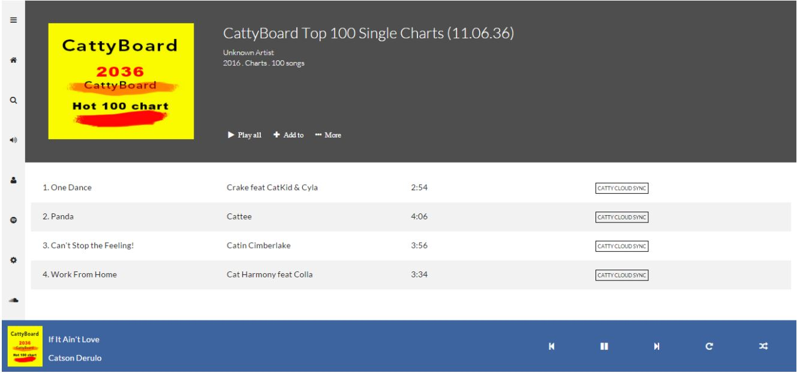

After walking through the boring rigorous stuffs, you deserve some fun project.

It’s time to walk through a practical example and apply your newly acquired Flexbox skills

You need to build a music app layout for cats. I call it catty music. 

Here’s what the finished layout looks like, and it is completely laid out with Flexbox.

You are free to use custom icons and images, but the layout should be the same as shown in figure.