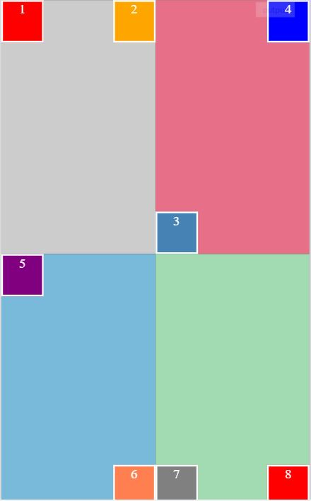

Add CSS properties to the given divs to position them at their assigned places. The width and height of big boxes are 50% and small boxes are 50 pixels. The colors used in the challenge are:

For main boxes:

#ccc

#e86f88

#79badb

#a2dbb1

For small boxes:

red

orange

steelblue

coral

blue

purple

gray

Your output should look like this:

